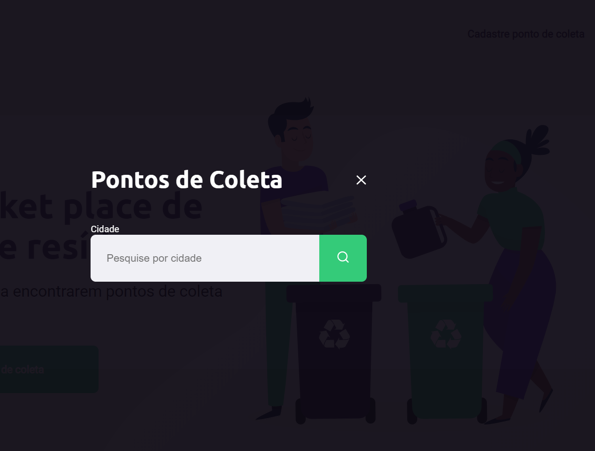

<h1 align="center">
    
</h1>

<h4 align="center"> 
NextLevelWeek 1.0
</h4>

<p align="center">
 
  

  
 
  

</p>


## About the Project

♻️ Ecoleta - Connects companies and entities that collects materials for recycling to people who need to dispose their waste in an ecological way.

Companies or entities may register on the web platform by sending:
- an image of the collection point
- providing entity name
- the address so that it can appear on the map
- selecting one or more type of materials:
  - lamps
  - Batteries
  - papers and cardboard
  - electronic waste
  - organic waste
  - kitchen oil

Project developed during **NLW - Next Level Week** offered by [**Rocketseat**][rs], a online development school.
NLW is an online experience with lots of practical content, challenges and hacks where the content is available for a week.


## 🎨 Layout

### Web

<p align="center" style="display: flex; align-items: flex-start; justify-content: center;">
  
  
  
  
</p>

## 🛠 Dev Technologies

- Node.js
- JavaScript
- HTML
- CSS

### Requirements

The basic tools needed to run this application are [Node.js][nodejs], [Git](https://git-scm.com) and a code editor, I choose to use [VSCode][vscode]

### Running the aplicattion (Front End)

```bash
# Clone this repsitory
$ git clone https://github.com/ogab81/NLW1

# Acess the projects folder on terminal/cmd
$ cd NLW1

# Instale as dependências
$ npm install

# Execute a aplicação em modo de desenvolvimento
$ npm run start

# A aplicação será aberta na porta:3000 - acesse http://localhost:3000
```


## Make more of this project

1. **fork** the project
2. Create a new branch with your features : `git checkout -b my-feature`
3. Save your changes : `git commit -m "feature: My new feature"`
4. Send back to GitHub: `git push origin my-feature`
> Some more info to make contributions on projects [guia de como contribuir no GitHub](https://github.com/firstcontributions/first-contributions)


## 📝 Licença

Under MIT licence.
By Gabe Portela 👋🏽 [Contact!](https://www.linkedin.com/in/gabriel-portela-788a25170/)

[nodejs]: https://nodejs.org/
[vscode]: https://code.visualstudio.com/
[vceditconfig]: https://marketplace.visualstudio.com/items?itemName=EditorConfig.EditorConfig
[license]: https://opensource.org/licenses/MIT
[vceslint]: https://marketplace.visualstudio.com/items?itemName=dbaeumer.vscode-eslint
[prettier]: https://marketplace.visualstudio.com/items?itemName=esbenp.prettier-vscode
[rs]: https://rocketseat.com.br